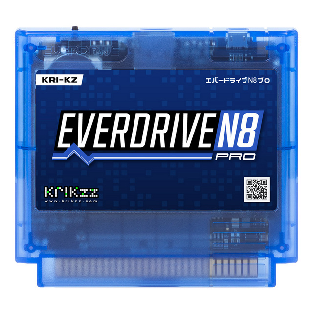

# EverDrive-N8 PRO Dev Sources

This repository contains libraries, tools and code examples for development targeting EverDrive-N8 PRO.

## Contents

| Path | Description |
|---|---|
| `/edio` | Examples of low level cartridge hardware access: SD card, USB, memory, FPGA registers, etc. |
| `/edio-cmd` | USB command scripts for the `/edio` application. |
| `/fpga` | FPGA mappers examples and reference projects. |
| `/n8nsf` | Source code of the NSF player for EverDrive-N8 PRO. |
| `/edlink.py` | Basic cross-platform launcher script for `edlink.exe`. Requires Mono runtime on Linux and macOS. |
| `/edlink.exe` | USB utility for communication with EverDrive over USB. |

---

    

